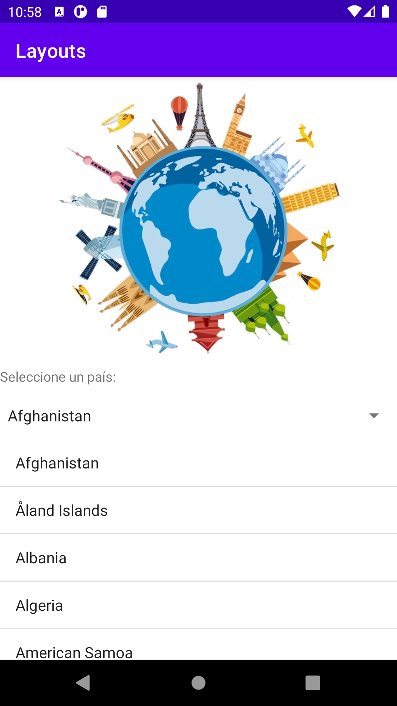

# ejemplos-clase

## Ejemplo 1
- Este ejemplo tiene una actividad principal con un RelativeLayout. Hay una imagen, luego un Spinner y luego un Listview que cargan la lista de países del archivo JSON.

- Al hacer clic en un país del Spinner se muestra el nombre del país en un TOAST LONG.

- Al hacer clic en un país del ListView, se abre una nueva actividad a la cual se envían todos los detalles del país seleccionado que vienen del objeto JSON y se abre la página de wikipedia utilizando el nombre del país.

- 
